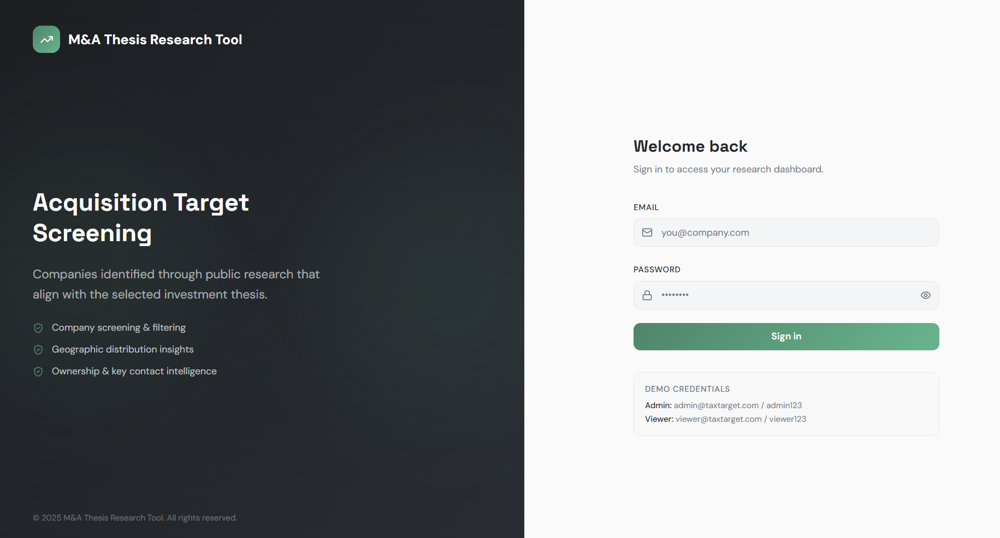
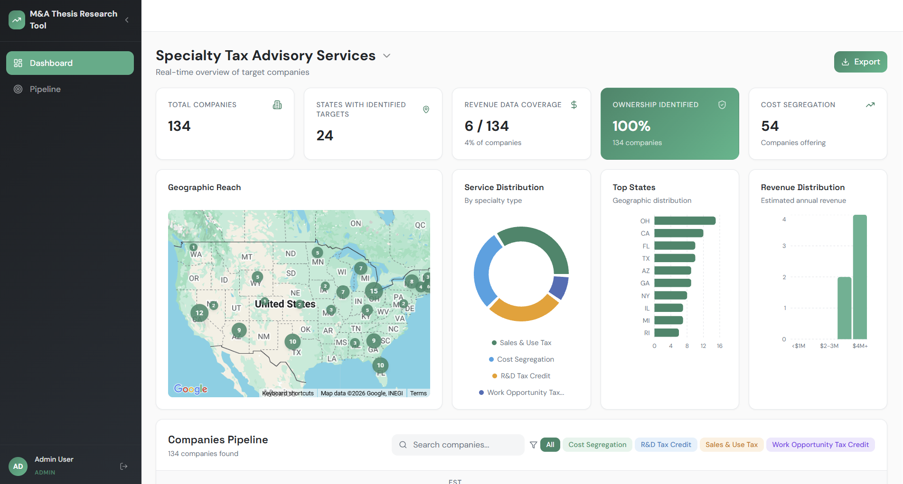
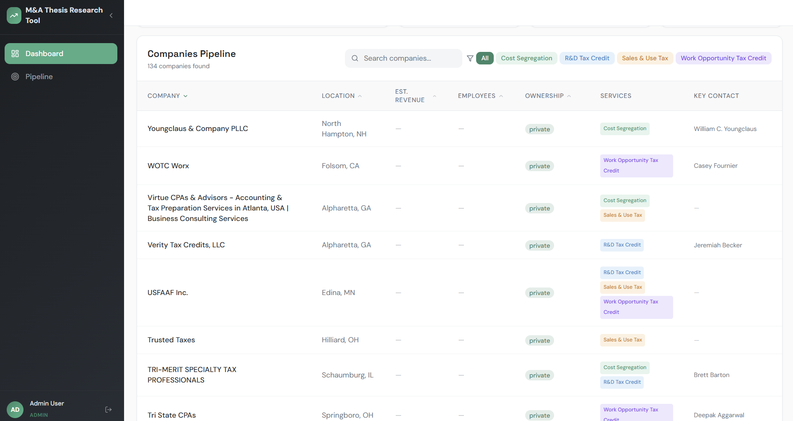
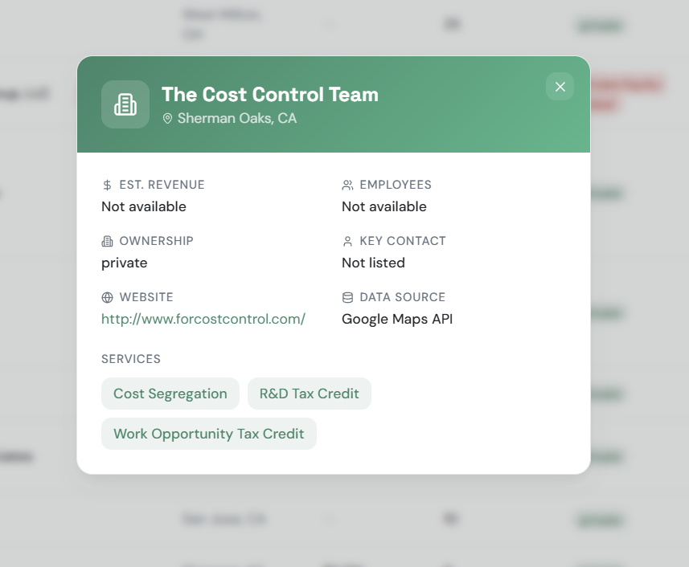
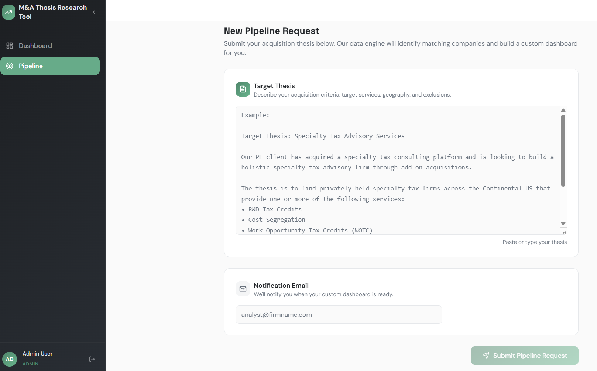

# M&A Thesis Research Tool - Project Walkthrough

---

## What Was Built

A full-stack application that takes an M&A investment thesis as input, automatically researches and collects matching companies via a multi-phase AI-powered pipeline, and presents the results in a polished, interactive dashboard.

---

## Part 1: Data Pipeline

### How It Works

The backend (`exit_mna_tool/`) runs a 2-phase pipeline triggered by a POST request to `/generate-config`:

**Phase 1 — Seed Collection**
- Accepts a free-text thesis description as input
- Uses **GPT-4** to parse the thesis and extract: target states, service types, revenue thresholds, ownership type, and exclusion criteria
- Queries **Google Maps Places API** with each extracted service type across all specified US states
- Deduplicates companies by normalized name + domain to avoid exact duplicates
- Stores raw company records in a **SQLite** database (`data/exit_group.db`)

**Phase 2 — AI Enrichment**
- Crawls each company's website (up to 5 pages)
- Uses a second GPT-4 call (with structured tool-calling) to extract per-company:
  - Services offered (R&D Credits, Cost Segregation, WOTC, Sales & Use Tax)
  - Ownership type (Private, PE-Backed, Public)
  - Key contact name and title
  - Revenue range (min/max)
  - Employee count range (min/max)
  - Exclusion flag + reason (ERC-only, Property Tax-only firms)
- Writes enriched data back to SQLite
- Sends a completion email to the user when done

**Pipeline entry point:**
```bash
# Start the Flask API (manages pipeline in background threads)
cd exit_mna_tool
python -m src.application

# Or run the pipeline directly end-to-end from CLI
python -m src.pipeline run
```

---

## Part 2: Dashboard

### Login



The dashboard is protected by role-based authentication. Use the credentials shown on the login page:

| Role | Email | Password |
|------|-------|----------|
| Admin | admin@taxtarget.com | admin123 |
| Viewer | viewer@taxtarget.com | viewer123 |

---

### Dashboard Overview



The main dashboard shows:

**KPI Cards (top row):**
- **Total Companies** - count of all pipeline companies
- **States with Identified Targets** - geographic spread
- **Revenue Data Coverage** - how many companies have revenue data
- **Ownership Identified** - percentage with known ownership type (highlighted green)
- **Cost Segregation** - number of companies offering this specific service

**Charts:**
- **Geographic Reach** - Google Maps with clustered state-level markers; click a state to see companies
- **Service Distribution** - donut chart breaking down companies by service type
- **Top States** - horizontal bar chart showing which states have the most targets
- **Revenue Distribution** - bar chart of estimated annual revenue buckets

---

### Company Pipeline Table



The table supports:
- **Search** - real-time text search across company name, city, state
- **Service filters** - color-coded buttons to filter by Cost Segregation, R&D Tax Credit, Sales & Use Tax, Work Opportunity Tax Credit
- **Column sorting** - click any column header to sort ascending/descending
- **Click to expand** - click any row to open a detailed company view with all available fields
- **Export to Excel** - top-right Export button downloads the current filtered view as an [.xlsx] file

Each row displays: Company Name, Location, Est. Revenue, Employees, Ownership badge, Service pills, Key Contact.

---

### PE-Backed Flagging


Companies identified as Private Equity-backed are flagged with a red **PE** badge next to the company name.

---

### Custom Thesis Pipeline



The **Pipeline** tab allows users to submit a custom M&A thesis:

1. Paste or type a free-text thesis description
2. Provide a notification email
3. Click **Submit Pipeline Request**
4. The system uses AI to parse the thesis and kicks off the pipeline in a background thread
5. A completion email is sent when the pipeline finishes

---

## Goals Achieved

### Required Deliverables

| Requirement | Status | Notes |
|---|---|---|
| Data pipeline collecting companies | ✅ | Google Maps API + AI enrichment |
| Company name, city, state | ✅ | |
| Website URL | ✅ | |
| Primary services offered | ✅ | R&D, Cost Seg, WOTC, Sales & Use Tax |
| Estimated revenue | ✅ | Crawled from website |
| Employee count | ✅ | Crawled from website |
| Ownership type | ✅ | Private, PE-Backed, Public |
| Key contact / owner name | ✅ | Name + title extracted via AI |
| Sortable, filterable table | ✅ | Sort by any column; filter by service, search |
| KPI summary cards | ✅ | 5 cards including revenue coverage + cost seg count |
| Chart or visual | ✅ | 4 charts: map, donut, bar (states), bar (revenue) |
| Filter by service type | ✅ | Color-coded service filter buttons |
| Click into company row for detail | ✅ | Full company detail modal |
| README with setup instructions | ✅ | Root [README.md] with full setup guide |

### Bonus Features Completed

| Bonus Item | Status | Notes |
|---|---|---|
| Custom thesis input | ✅ | Pipeline tab - any free-text thesis |
| Export function | ✅ | Excel export with current filtered data |
| Flag PE-backed companies | ✅ | Red "PE" badge + red ownership pill |
| Basic authentication + RBAC | ✅ | Admin and Viewer roles; session persistence |
| Deploy live | ✅ | Deployed to Vercel; link: https://dashboard-phi-mauve-36.vercel.app/ |

---